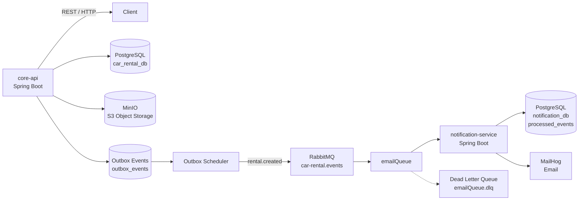

# Car Rental API
Backend System for car rental platform built with Java and Spring Boot

The system allows users to register, add and rent vehicles, manage rentals and payments, while administrators can approve or reject submitted cars. Email notifications are processed asynchronously using RabbitMQ and a separate notification service.

## Architecture
The application consists of two Spring Boot services:
- **core-api** - handles users, cars, rentals, payments, authentication, security
- **notification-service** - handles rental events from RabbitMQ and sends email notifications




## Technologies
- Java 17
- Spring Boot
- Spring Data JPA/Hibernate
- Spring Security
- JWT 
- PostgreSQL
- Flyway
- RabbitMQ
- Mailhog
- MinIO (S3 compatible)
- Docker Compose
- JUnit 5 / Mockito
- Testcontainers
- RestAssured
- Github Actions
- MapStruct
- Swagger / OpenAPI

## Main Features
### Authentication & Authorization
- User registration and login
- Stateless JWT authentication
- Role-based authorization (USER, ADMIN)
- Protected endpoints (Spring Security)
### Car Management
- Add cars with validation
- Upload images of car
- Image storage using MinIO
- Car approval/rejection for administrators
- Pagination for car listings
### Car Rental
- Rent available cars for selected period
- Validation of rental dates
- Detection of overlapping rentals
- Payment processing
- Rental history
- Returning active rentals
### Concurrency Control
The application uses two types of database locking:
- **Optimistic locking** using `@Version` for concurrent user/account updates
- **Pessimistic locking** when processing rental requests to prevent conflicting operations on the same car
### Transactional Outbox
Rental creation and creation of the corresponding event are performed within the same database transaction.

The event is stored in the `outbox_events` table with a `PENDING` status. A scheduled publisher later sends pending events to RabbitMQ.

This prevents the dual-write problem where the database transaction succeeds but publishing the message fails.
The Outbox pattern provides reliable event publication but does not guarantee exactly-once delivery. Duplicate delivery is handled on the consumer side using event IDs.
### Asynchronous Notifications
After a rental is created:

1. core-api creates a RentalCreatedEvent
2. The event is stored in the Outbox
3. OutboxScheduler publishes it to RabbitMQ
4. notification-service consumes the event
5. An email confirmation is sent through MailHog

The notification service also stores processed event IDs to avoid processing duplicate events.
### Dead Letter Queue

Failed notification messages can be routed to a dedicated Dead Letter Queue (`emailQueue.dlq`) after the configured retry attempts.

This prevents repeatedly failing messages from being processed indefinitely.
### File Storage & Failure Handling
Car images are stored in MinIO.

If the database operation fails after images have already been uploaded, the uploaded objects are removed to prevent orphaned files.
### Database Migrations

Database schemas are managed using Flyway migrations.

Example migrations include:

- initial database schema
- optimistic locking version column
- database constraints
- transaction ledger fields
- outbox table
- processed events table for the notification service
### Testing

The project contains both unit and integration tests.

#### Unit Tests

Business logic is tested with JUnit 5 and Mockito.

#### Integration Tests

Integration tests use:

- Spring Boot
- PostgreSQL Testcontainers
- RestAssured

Example scenarios include:

- successful car rental
- unavailable car
- overlapping rental
- invalid rental period
- unauthorized operations
- duplicate license plate
- invalid image uploads
- outbox event creation 
### CI

GitHub Actions automatically runs the Maven verification phase for both services.

### Running Locally
#### Requirements
- Docker
- Docker Compose
- Java 17
#### 1. Start infrastructure
`docker compose up -d`
#### 2. Run core-api
`cd core-api`

`./mvnw spring-boot:run`
#### 3. Run notification-service
`cd notification-service`

`./mvnw spring-boot:run`

The services communicate through RabbitMQ.

## API Endpoints

### Authentication
- `POST /api/users/register` - register a new user
- `POST /api/auth/login` - authenticate and obtain a JWT

### Users
- `PATCH /api/users/withdraw-funds` - withdraw virtual funds to user account
- `PATCH /api/users/add-funds` - add virtual funds to user account

### Cars
- `POST /api/cars/add` - add a car
- `GET /api/cars/available` - get available cars
- `GET /api/cars/my-cars` - get cars owned by the authenticated user
- `PATCH /api/cars/approve/{carId}` - approve a car (ADMIN)
- `PATCH /api/cars/reject/{carId}` - reject a car (ADMIN)
- `PATCH /api/cars/withdraw/{carId}` - withdraw a car

### Rentals
- `POST /api/rentals/rent` - rent a car
- `PATCH /api/rentals/return/{rentalId}` - return a rental
- `GET /api/rentals/my-rentals` - get user's rentals

## Failure Scenarios

The system handles several failure scenarios explicitly:

- Database failure after image upload -> uploaded objects are removed from MinIO to prevent orphaned files
- RabbitMQ publishing failure -> Outbox events remain `PENDING` and are retried by the scheduler
- Duplicate RabbitMQ event -> notification service detects already processed event IDs
- Concurrent rental requests -> pessimistic locking is used for the selected car
- Concurrent account updates -> optimistic locking prevents lost updates

## API Documentation

The API is documented using OpenAPI/Swagger.

When the application is running:

`http://localhost:8080/swagger-ui/index.html`

## Project Structure
```
car-rental-api/
├── .github/
│   └── workflows/
│       └── ci.yml
├── core-api/
│   └── src/main/java/com/example/car_rental_api/
│       ├── car/
│       ├── config/
│       ├── exception/
│       ├── outbox/
│       ├── payment/
│       ├── rental/
│       ├── security/
│       ├── storage/
│       ├── transaction/
│       ├── user/
│       └── utils/
│   └── resources/
│       ├── db/migration/
│       └── application.properties
│   └── test/
│       └── java/com/example/car_rental_api/
│           ├── integration/
│           └── (unit tests)
│
├── notification-service/
│   └── src/main/java/com/example/notification_service/
│       ├── config/
│       ├── dto/
│       ├── event/
|       ├── repository/
│       └── service/
│   └── resources/
│       ├── db/migration/
│       └── application.properties
│   └── test/
│       └── java/com/example/notification_service/
│           └── (unit test)
│
├── docker/
├── docker-compose.yml
├── .gitignore
└── README.md
```
## Known Limitations

This project is intended as a learning project and is not production-ready.

Current limitations include:

- no refresh token mechanism
- no production email provider
- no distributed tracing
- Outbox publishing is scheduler-based
- MinIO is used instead of a managed cloud object storage service